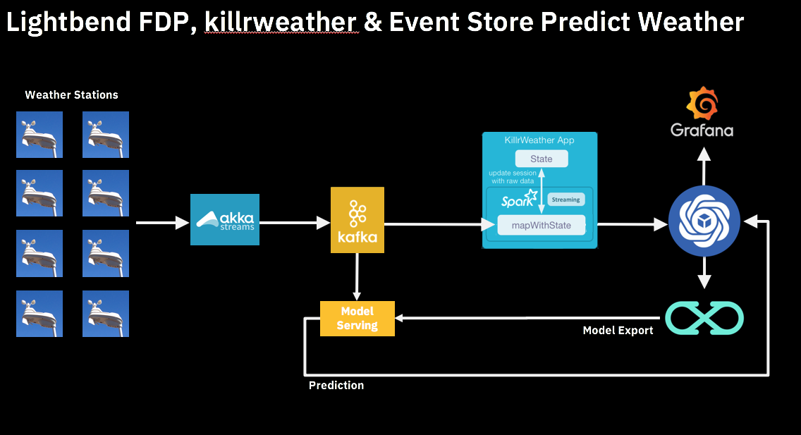
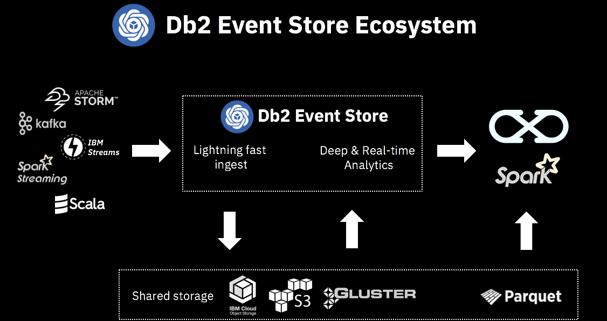
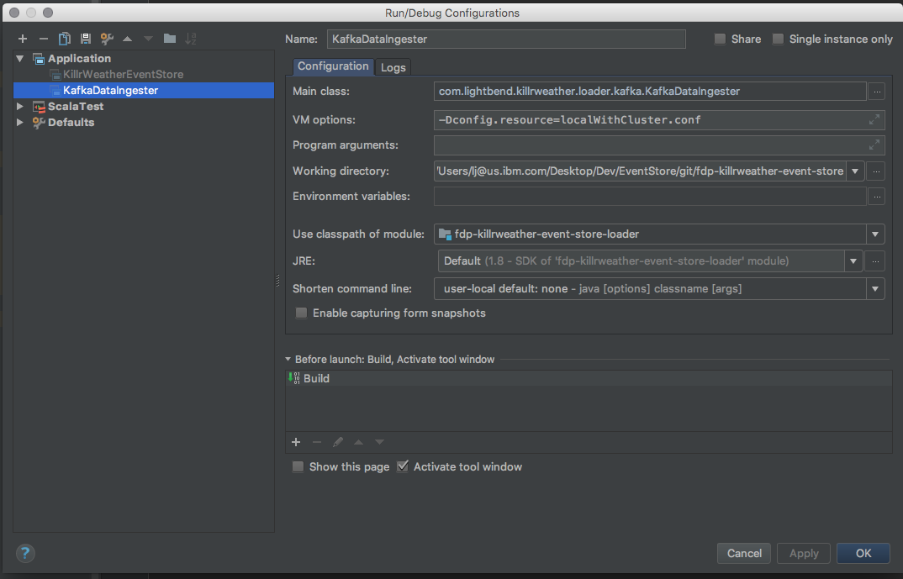
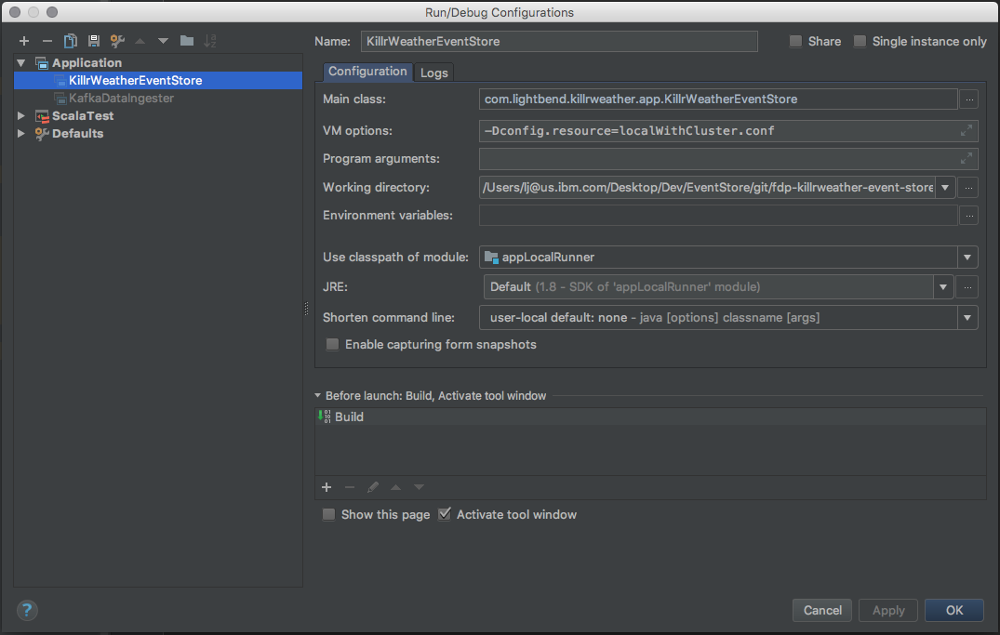

# Reactive Summit, Montreal, Canada - Oct 22, 2018

##### Introduction
This lab will review & run an end to end application written on top of the IBM Db2 Event Store. The App implements a Weather prediction model using the following products & projects:
* [The IBM DB2 Event Store](https://www.ibm.com/support/knowledgecenter/en/SSGNPV_1.1.2/eventstore/welcome.html)
* [The IBM Data Science Experience local](https://datascience.ibm.com/local)
* [The Lightbend Fast Data Platform](https://www.lightbend.com/products/fast-data-platform)
* [Apache Spark](http://spark.apache.org)
* [Apache Kafka](http://kafka.apache.org)
* [Akka](https://akka.io/)
* [Grafana](https://grafana.com/)

##### YouTube Video Demo

As a reference, the following video was recorded when running the entire application on top of the IBM Fast Data Platform. In this lab, in order to simplify our runtime configuration and clarity of understanding, the App is made to run standalone against the IBM Db2 Event Store Dev. Edition.

(https://youtu.be/q9LmWtZAAdU "Reactive Summit 2018 Demo")

##### Tools required

* SBT 0.13.16
* MacOS Terminal Window
* Git
* IBM Db2 Event Store 1.1.4
* IntelliJ 2017.3
* Grafana 5.3.1
* Docker 18.06.1-ce

---

## Lab Use Case

_I need fast access to real time data to analyze it, execute machine learning and leverage these models for predictive analytics._

---

## Presentation of the IBM Db2 Event Store & Fast Data


---

## IBM Db2 Event Store Reference Architecture



---

## Reference Architecture

Final architecture of the implementation looks as follows


This lab presents the following technology:
- **Akka** is an advanced toolkit and message-driven runtime based on the Actor Model that helps development teams build the right foundation for successful microservices architectures and streaming data pipelines.
- **Apache Kafka** provides scalable, reliable, and durable short-term storage of data, organized into topics (like traditional message queues), which can be consumed by downstream applications.
- We have an application named KillrWeather that will process those messages and stream them to the **IBM Db2 Event Store** where they can be visualized graphically in Grafana
- A supervised learning **Machine Learning** model that is trained on the incoming data so that it be later used to score the in-flight data in order to predict temperatures
-- The algorithm is given training data which contains the "correct answer" for each event
- A model serving component that receives the online model and does the scoring. Predicted values are then associated with their incoming Event

---

## Prerequisites

In the course of this lab, we will provide the exact version number that were locally tested. Feel free to adjust this for your own environment, as long as you can maintain the compatibility requirements.

* The IBM Db2 Event Store Developer Edition 1.1.4
* IntelliJ CE 2017.3
* SBT 0.13.16 (version tested)
* Docker Version 18.06.1-ce-mac73 (26764)

---

## Installing IBM Db2 Event Store

##### References
[IBM Db2 Dev Edition](https://www.ibm.com/support/knowledgecenter/en/SSGNPV_1.1.2/eventstore/desktop/welcome.html)

##### Increase Docker CPU/Mem
* 6 CPU / 8 GB

#####  Installing the IBM Db2 Event Store
```bash
* *Lab*
** Get the files from the USB drive
* *Online*
** Download the correct file & install
*** https://github.com/IBMProjectEventStore/EventStore-DeveloperEdition/releases/download/1.1.4

** Lab - On MacOS **
wget https://es-desktop.cdnedge.bluemix.net/es_desktop.tar.gz/1.1.4
wget https://github.com/IBMProjectEventStore/EventStore-DeveloperEdition/releases/download/1.1.4/IBM.Db2.Event.Store.-.Developer.Edition-1.1.4.dmg
mv 1.1.4 es_desktop.tar.gz  
mkdir ~/Library/Application\ Support/ibm-es-desktop
cp es_desktop.tar.gz ~/Library/Application\ Support/ibm-es-desktop

** Lab - On Windows **
Windows Explorer
C:\Users\Administrator\AppData\Roaming in Windows Explorer and copy the gzip file to ibm-es-desktop folder.
_Caution: hidden folder_
_Press "Alt" button and under "Tools" -> "Folder Options" click on "View" tab and select "Show hidden files, folders and drives" radio button_
wget https://es-desktop.cdnedge.bluemix.net/es_desktop.tar.gz/1.1.4
mkdir C:\Users\Administrator\AppData\Roaming\ibm-es-desktop
copy es_desktop.tar.gz C:\Users\Administrator\AppData\Roaming\ibm-es-desktop
wget https://github.com/IBMProjectEventStore/EventStore-DeveloperEdition/releases/download/1.1.4/IBM.Db2.Event.Store.-.Developer.Edition.Setup.1.1.4.exe

** Lab - MacOS & Windows **
* Start the installer (dmg or exe) and follow the instructions
```

#####  Cleaning up the IBM Db2 Event Store metadata

In case, the IBM Db2 Event Store Dev. Edition 1.1.4 docker container needs to be reinitialized, the following procedure can be applied. This will remove the containers and delete all the data and metadata.

Reset the IBM Db2 Event Store Dev. Edition 1.1.4:

```bash
docker stop $(docker ps -aq)
docker rm $(docker ps -aq)
cd ~/Library/Application\ Support/ibm-es-desktop
rm -rf zookeeper alluxio ibm
```

---
Understanding Notebooks, IBM Db2 Event Store and its Scala Client API
---

## Notebooks

##### Tools
* IBM Db2 Event Store

##### Objectives
* Understand how to use a Jupyter Notebook to interact with the IBM Db2 Event Store
* Understand the IBM Db2 Event Store Scala API

##### References
[Db2 Event Store Scala API](https://www.ibm.com/support/knowledgecenter/en/SSGNPV_1.1.2/eventstore/develop/dev-guide.html)

##### Lab Assignments
```bash
* In the IBM Db2 Event Store
* Run the Notebook *Introduction to IBM Db2 Event Store Scala API*
** Run all the Cells
** Review of the Event Store Scala API
** Understanding the Event Store SparkSQL query architecture
** Understanding querying the Db2 Event Store with different Snapshot settings
*** Review of the IBM Db2 Event Store Reference Architecture
_Make sure to allocate enough Docker Memory_
```

##### Lab Assignment
```bash
* Stop the kernel for the running notebooks
* Create a new Scala notebook and create a new table named ReactiveSummit
* Drop *ReviewTable* & *ReactiveSummit* table
```

---
Understanding Kafka & IBM Db2 Event Store
---

## Kafka Ingest

##### Tools 
* SBT
* Terminal Window
* Git
* IBM Db2 Event Store

##### Objectives
* Understand how to stream data into the IBM Db2 Event Store with Kafka

##### References
[Installing sbt](https://www.scala-sbt.org/download.html)
[Kafka Data Source Git Repo](https://github.com/IBMProjectEventStore/db2eventstore-kafka)

##### Installing Sbt 0.13.16
```bash
* sbt supplied with archive or install on your own
./bin/sbt sbt-version
* Should be at 0.13.16 level 
```

##### Lab Assignment
```bash
* Open a Terminal window
* Follow the direction from the following GIT repo on how to setup
* https://github.com/IBMProjectEventStore/db2eventstore-kafka
sbt "eventStream/run -localBroker true -kafkaBroker localhost:9092 -topic estopic -eventStore localhost:1100 -database TESTDB -user admin -metadata sensor -password password -metadata ReviewTable -streamingInterval 5000 -batchSize 10"
sbt "dataLoad/run -localBroker true -kafkaBroker localhost:9092 -tableName ReviewTable -topic estopic -group group -metadata sensor -metadataId 238 -batchSize 10"
** Understand the parameters provided to the connector & generator
*** Modify the connector batch size
** Stop the Ingest & Generator
```

---
Understanding REST & IBM Db2 Event Store
---

## REST API

##### Tools 
* Terminal Window
* Curl
* IBM Db2 Event Store

##### Objectives
* Understand the IBM Db2 Event Store REST API

##### Reference
* [IBM DB2 Event Store Documentation](https://www.ibm.com/support/knowledgecenter/en/SSGNPV_1.1.2/eventstore/welcome.html)
* [IBM DB2 Event Store Rest API](https://www.ibm.com/support/knowledgecenter/en/SSGNPV_1.1.2/eventstore/develop/rest-api.html)

##### Lab Assignment
```bash
* Open a Terminal window
* SBT ingest with kafka into the IBM Db2 Event Store (with the generator)
* Run the following curl commands

* Navigating the Catalog & Data:
curl -X POST -H "Content-Type: application/json" -H "authorization: Bearer token" 'http://0.0.0.0:9991/com/ibm/event/api/v1/init/engine?engine=173.19.0.1:1100&rContext=Desktop'
curl -X GET -H "Content-Type: application/json" -H "authorization: Bearer token" http://0.0.0.0:9991/com/ibm/event/api/v1/oltp/databases
curl -X GET -H "Content-Type: application/json" -H "authorization: Bearer token" http://0.0.0.0:9991/com/ibm/event/api/v1/oltp/tables?databaseName=TESTDB

* Running Spark Query:
curl -k -i -X POST -H "Content-Type: application/json" -H "authorization: Bearer token" --data "{\"sql\": \"select * from ReviewTable\"}" "http://0.0.0.0:9991/com/ibm/event/api/v1/spark/sql?databaseName=TESTDB&tableName=ReviewTable&format=json"
```

curl -k -i -X POST -H "Content-Type: application/json" -H "authorization: Bearer token" --data "{\"sql\": \"SELECT avg(value), avg(ts) FROM ReviewTable WHERE sensor=238 AND ts>=1540167276448 AND ts<=1540167576448 GROUP BY ts DIV 200\"}" "http://0.0.0.0:9991/com/ibm/event/api/v1/spark/sql?databaseName=TESTDB&tableName=ReviewTable&format=json"


---
Data Visualization
---

## Grafana integration

##### Tools 
* Grafana
* Terminal Window
* Curl
* IBM Db2 Event Store

##### Objectives
* Understand how to visualize the ingested data

##### Reference
[Installing Grafana](https://grafana.com/grafana/download?platform=mac)
[Grafana Data Source Git Repo](https://github.com/IBMProjectEventStore/db2eventstore-grafana)

##### Lab Assignment
```bash
- Grafana setup
brew update 
brew install grafana
brew services restart grafana

* Check Grafana:
http://localhost:3000 [admin/admin]

* Install IBM Db2 Event Store plugin:
mkdir -p /usr/local/var/lib/grafana/plugins/db2-event-store
mv db2-event-store-grafana.tar /usr/local/var/lib/grafana/plugins/db2-event-store
cd /usr/local/var/lib/grafana/plugins/db2-event-store
tar -zxvf db2-event-store-grafana.tar
brew services restart grafana

http://localhost:3000 [admin/admin]
* Add a Db2 Event Store Data Source

* Restart the generator and kafka stream
* Add a new Dashboard
** Create a new graph and visualize the incoming data for ReviewTable
```

---
End to End Application with KillrWeather
---

## KillrWeather Application without ML

##### Tools 
* Terminal Window
* SBT
* Curl
* IBM Db2 Event Store
* IntelliJ

##### Objectives
* Understand & Run the end to end application

##### Reference
* [IBM DB2 Event Store Documentation](https://www.ibm.com/support/knowledgecenter/en/SSGNPV_1.1.2/eventstore/welcome.html)
* [IBM DB2 Event Store Rest API](https://www.ibm.com/support/knowledgecenter/en/SSGNPV_1.1.2/eventstore/develop/rest-api.html)
* [KillrWeather Git Repo](https://github.com/lightbend/fdp-killrweather-event-store)

##### Lab Assignments

```bash
- KillRWeather Repo Setup
git clone git@github.com:lightbend/fdp-killrweather-event-store.git
* Understand the module structure

- IntelliJ Setup
* Import Project
* Select the project root directory
* Select sbt as the project type
* Use the default settings for sbt. Use JDK 1.8 if it's not shown as the default.

- Compile the code
* Open a terminal window in IntelliJ
sbt clean
sbt compile

* Run the sample
```

**Data ingest**


**Streaming App**


```bash
* Stop the ingest
* Run a REST API call to find out how many rows have been ingested in the table "raw_weather_data"
```

---
Understanding Machine Learning
---

## KillrWeather Application with ML

##### Tools 
* Terminal Window
* Curl
* IBM Db2 Event Store
* IntelliJ

##### Objectives
* Understand ML

##### Reference
* [Spark ML](https://spark.apache.org/docs/1.2.2/ml-guide.html)
* [Jean-Francois Puget Feedback loop](https://www.kdnuggets.com/2017/06/practical-guide-machine-learning-understand-differentiate-apply.html)

##### Lab Assignment
```bash
* In IBM Db2 Event Store Desktop
** Add Notebooks
** Select "Weather+Prediction+Model.ipynb"
*** We won't have the SPSS libraries in today's environment, but this is a good sample to have, for reference
** Select "Weather+Spark+ML.ipynb" - Using SparkML instead
*** Run the cells
** Understand the different between training_data & test_data
```

---
Understanding Scoring
---

## KillrWeather Application with ML and Feedback Loop

##### Tools 
* Terminal Window
* Curl
* IBM Db2 Event Store
* IntelliJ

##### Objectives
* Understand Scoring

##### Lab Assignment
```bash
* Which table will carry the new prediction with any given Event?

* KillrWeather
** In IntelliJ, restart Ingest
** In IntelliJ, run the ModelServer & ModelListener

* Push the PMML over to the Model listener

curl -X POST -d {\"wsid\":\"72202012839\",\"pmml\":\"\<?xml version='1.0' ?\>\<PMML version='4.3' xmlns='http://www.dmg.org/PMML-4_3' xmlns:xsi='http://www.w3.org/2001/XMLSchema-instance' xsi:schemaLocation='http://www.dmg.org/PMML-4_3 http://www.dmg.org/v4-3/pmml-4-3.xsd'><Header copyright='(c) Copyright IBM Corp. 2011, 2015' description='linear engine'><Application name='Analytic Framework' version='3.0'></Application><Timestamp>Tue Mar 13 23:18:39 2018</Timestamp></Header><DataDictionary numberOfFields='13'><DataField name='wsid' displayName='wsid' optype='categorical' dataType='string'><Value value='722020:12839' property='valid'></Value></DataField><DataField name='year' displayName='year' optype='continuous' dataType='integer'></DataField><DataField name='month' displayName='month' optype='continuous' dataType='integer'></DataField><DataField name='day' displayName='day' optype='continuous' dataType='integer'></DataField><DataField name='ts' displayName='ts' optype='continuous' dataType='integer'></DataField><DataField name='high' displayName='high' optype='continuous' dataType='double'></DataField><DataField name='low' displayName='low' optype='continuous' dataType='double'></DataField><DataField name='mean' displayName='mean' optype='continuous' dataType='double'></DataField><DataField name='variance' displayName='variance' optype='continuous' dataType='double'></DataField><DataField name='stdev' displayName='stdev' optype='continuous' dataType='double'></DataField><DataField name='day-1' displayName='day-1' optype='continuous' dataType='double'></DataField><DataField name='day-2' displayName='day-2' optype='continuous' dataType='double'></DataField><DataField name='day-3' displayName='day-3' optype='continuous' dataType='double'></DataField></DataDictionary><GeneralRegressionModel modelType='generalLinear' targetVariableName='mean' algorithmName='LE' functionName='regression'><Extension extender='spss.com' name='modelID' value='0'></Extension><MiningSchema><MiningField name='day-1'></MiningField><MiningField name='day-2'></MiningField><MiningField name='day-3'></MiningField><MiningField name='mean' usageType='predicted'></MiningField></MiningSchema><ModelStats><UnivariateStats field='mean'><Anova><AnovaRow degreesOfFreedom='4.0' fValue='3786.201363731769' meanOfSquares='7400.271882512297' pValue='0.0' sumOfSquares='29601.08753004919' type='Model'></AnovaRow><AnovaRow degreesOfFreedom='2430.0' meanOfSquares='1.9545373242426847' sumOfSquares='4749.525697909724' type='Error'></AnovaRow><AnovaRow degreesOfFreedom='2434.0' sumOfSquares='34350.613227958915' type='Total'></AnovaRow></Anova></UnivariateStats><UnivariateStats field='mean'><Counts totalFreq='2435.0'></Counts><NumericInfo maximum='29.583333333333332' mean='23.96204441248872' minimum='4.354166666666667' standardDeviation='3.7567038531902854'></NumericInfo></UnivariateStats><UnivariateStats field='day-1'><Counts totalFreq='2435.0'></Counts><NumericInfo maximum='29.6' mean='23.971457905544145' minimum='4.4' standardDeviation='3.7602528327004956'></NumericInfo></UnivariateStats><UnivariateStats field='day-2'><Counts totalFreq='2435.0'></Counts><NumericInfo maximum='29.6' mean='23.972854209445604' minimum='4.4' standardDeviation='3.7385165539743586'></NumericInfo></UnivariateStats><UnivariateStats field='day-3'><Counts totalFreq='2435.0'></Counts><NumericInfo maximum='29.6' mean='23.970718685831645' minimum='4.4' standardDeviation='3.714322046776944'></NumericInfo></UnivariateStats></ModelStats><Targets><Target field='mean' optype='continuous'></Target></Targets><ParameterList><Parameter label='Intercept' name='P0000001'></Parameter><Parameter label='day-1' name='P0000002'></Parameter><Parameter label='day-2' name='P0000003'></Parameter><Parameter label='day-2 * day-2' name='P0000004'></Parameter><Parameter label='day-3 * day-3' name='P0000005'></Parameter></ParameterList><CovariateList><Predictor name='day-1'></Predictor><Predictor name='day-2'></Predictor><Predictor name='day-3'></Predictor></CovariateList><PPMatrix><PPCell parameterName='P0000002' predictorName='day-1' value='1'></PPCell><PPCell parameterName='P0000003' predictorName='day-2' value='1'></PPCell><PPCell parameterName='P0000004' predictorName='day-2' value='2'></PPCell><PPCell parameterName='P0000005' predictorName='day-3' value='2'></PPCell></PPMatrix><ParamMatrix><PCell beta='6.613303128878097' df='1' parameterName='P0000001'></PCell><PCell beta='0.9872189908600112' df='1' parameterName='P0000002'></PCell><PCell beta='-0.524053288645944' df='1' parameterName='P0000003'></PCell><PCell beta='0.008062367469378615' df='1' parameterName='P0000004'></PCell><PCell beta='0.002550459044802118' df='1' parameterName='P0000005'></PCell></ParamMatrix></GeneralRegressionModel></PMML>\"} http://localhost:5000

* Query that table in REST to see the prediction
```

---
End 2 End visualization
---

## Data Visualization for KillrWeather Application with ML and Feedback Loop

##### Tools 
* Terminal Window
* Curl
* IntelliJ
* Grafana

##### Objectives
* Understand Scoring

##### Lab Assignment
```bash
* Create a new Grafana Dashboard and visualize daily_aggregate_temperature & daily_predicted_temperature
```
